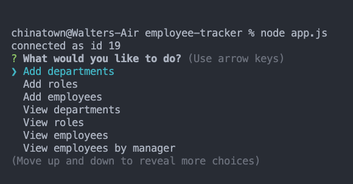

# employee-tracker
This project is to create a CLI that allows users to interact with the mySQL database, which includes functionalities such as viewing data based on specified criteria, adding data, removing data, and updating data. This is performed by designing questions using the NPM Inquirer package, then retrieving data directly from mySQL and offering the data as choices for the users. The selected answers are then fed into the query to re-query / update the database again.
### GitHub:https://github.com/wsglobe/employee-tracker
### Recordings:https://drive.google.com/file/d/10pol072iI-s2_F1YUoltHtDiBoCEP0NF/view
### Screenshot
